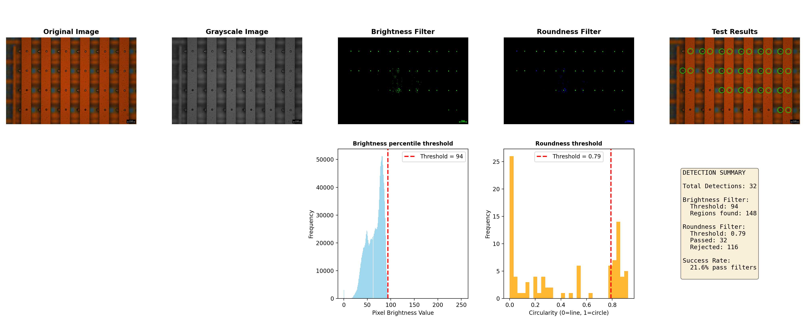

# Etch Detection

Minimal wrapper for the notebook pipeline.

## How It Works

The algorithm detects etched features (circular dots) in optical images using a two-step filtering approach:

**Step 1: Brightness Filter**  
Etchings appear as the brightest regions in the image. We keep only the brightest 0.1% of pixels (configurable via `--brightness` parameter). This isolates candidate regions from the background noise.

**Step 2: Roundness Filter**  
Etchings are circular, but noise often creates irregular shapes. We measure circularity (0 = line, 1 = perfect circle) for each candidate region and keep only those above the roundness threshold (configurable via `--roundness` parameter, default 0.65). This filters out non-circular noise.

**Output**: A list of detected etch locations marked on the original image, plus a detailed analysis report showing all pipeline stages.

## Venv

```bash
bash ./setup_venv.sh
source venv/bin/activate
```

## Run (single image)

```bash
python etch_detection.py --input Optical_Imaging_1T1R_Arrays_VIA_etch/Array5_Reticle3.jpg --brightness 0.999 --roundness 0.65
```

## Run (batch folder)

```bash
python etch_detection.py --input Optical_Imaging_1T1R_Arrays_VIA_etch --brightness 0.999 --roundness 0.65
```

## Output

```
results/
  <image_name>/
    original.png
    test_results.png
    analysis.png
```

## Example

Analysis pipeline output showing all stages of etch detection:


